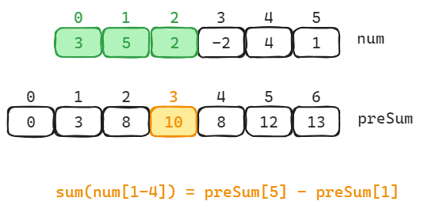

## 题目
- [LeetCode 303 计算数组区间内的元素和](../java/src/practice/01_array_string/NumArray.java)

## 核心思路

通过一个新数据 `preSum` 来记录数组 `nums` 的前缀和，`preSum[i]` 表示 `nums` 中索引从 `0` 到 `i-1` 的元素和。

如果要计算 `nums` 中索引从 `i` 到 `j` 的元素和，只需要计算 `preSum[j+1] - preSum[i]` 即可。

